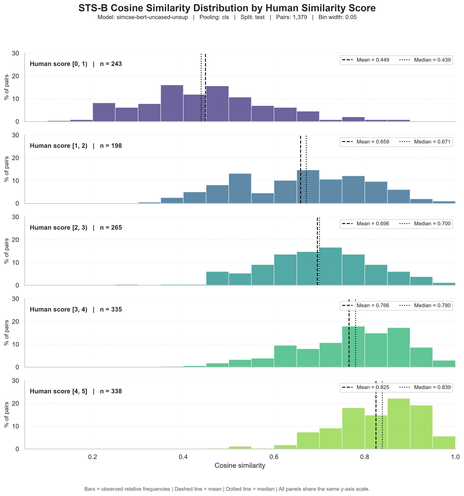
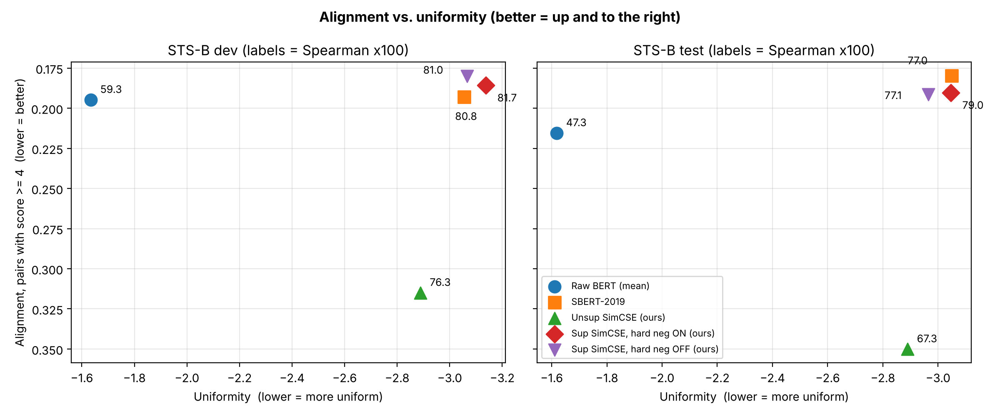

# U2T02 — SimCSE: Training Our Own Sentence Embedding Model

**Universidad Politécnica de Yucatán — Natural Language Processing**

**Team members**

| Name | Role in this project |
|---|---|
| **Acosta Castellanos Bianca Alexandra** | Part 1 theory, model card, CPU QA, report compilation |
| **Canche Chuc Angel Rivaldo** | Evaluation harness, baselines, alignment/uniformity, failure analysis |
| **Ku Aguilar Russel** | Model/training pipeline, unsupervised SimCSE + ablation, Hub publication |
| **Sanchez Novelo Damian** | SNLI data pipeline, dataset/run-log validation, similarity-distribution plots |
| **Velasco Martin Jonathan Abisai** | Supervised SimCSE, hard-negative ablation, hyperparameter and seed study |

**Headline results (STS-B Spearman ×100, dev / test):** unsupervised SimCSE **76.32 / 67.32**; supervised SimCSE with hard negatives **81.67 / 79.02**. The supervised model beats SBERT-2019 on test (79.02 vs. 76.98) using 33k training pairs. The unsupervised model is published and verified on the Hugging Face Hub: [RusselKuAguilar/simcse-bert-uncased-unsup](https://huggingface.co/RusselKuAguilar/simcse-bert-uncased-unsup).

---

## Part 1 — Understanding the objective

### 1.1 Eq. 1 and Eq. 5: numerator, denominator and number of negatives

Unsupervised SimCSE (Gao et al., 2021, Eq. 1) minimizes, for each sentence $x_i$ in a mini-batch of $N$ sentences,

$$\ell_i = -\log \frac{e^{\mathrm{sim}(h_i,\,h_i^{+})/\tau}}{\sum_{j=1}^{N} e^{\mathrm{sim}(h_i,\,h_j^{+})/\tau}}, \qquad \mathrm{sim}(a,b)=\frac{a^\top b}{\lVert a\rVert\,\lVert b\rVert}.$$

- **Numerator:** the exponentiated, temperature-scaled cosine similarity between the anchor $h_i$ and its own positive $h_i^{+}$. In the unsupervised case, $h_i$ and $h_i^{+}$ are two encodings of the same sentence with **different dropout masks** $z, z'$. Dropout is the only data augmentation.
- **Denominator:** a sum over all $N$ positives of the batch, $h_1^{+},\dots,h_N^{+}$. It includes the anchor's own positive ($j=i$) and the $N-1$ positives of the other sentences, which serve as **in-batch negatives**. The loss is the cross-entropy of a softmax classifier that must pick $h_i^{+}$ among $N$ candidates.
- **Negatives per step with our batch size ($N=64$):** each anchor is pushed away from **$N-1 = 63$ negatives**. One optimization step has $64 \times 63 = 4{,}032$ anchor–negative pairs.

The supervised version (Eq. 5) uses NLI triplets: the premise is the anchor, its entailment hypothesis is the positive $h_i^{+}$, and its contradiction hypothesis is a hard negative $h_i^{-}$:

$$\ell_i = -\log \frac{e^{\mathrm{sim}(h_i,h_i^{+})/\tau}}{\sum_{j=1}^{N}\left(e^{\mathrm{sim}(h_i,h_j^{+})/\tau}+e^{\mathrm{sim}(h_i,h_j^{-})/\tau}\right)}.$$

With full triplets the denominator has $2N$ terms, so each anchor has $(N-1)+N = 127$ negatives at $N=64$. In our SNLI subset only **9,488 of 33,351 pairs (28.45 %)** have a contradiction. We do not invent missing negatives and never substitute a positive for one. Each anchor therefore sees $63 + K$ negatives, where $K$ is the number of real contradictions in that batch. With uniform shuffling $K \sim \mathrm{Binomial}(64, 0.2845)$, so $\mathbb{E}[K] \approx 18.2$ (sd ≈ 3.6). That gives **≈ 81 negatives per anchor on average**, instead of the paper's 127.

### 1.2 The temperature τ

$\tau$ scales the cosine logits before the softmax. Cosine lies in $[-1,1]$, so the logits span a range of $2/\tau$: 40 at $\tau=0.05$, but only 2 at $\tau=1$. The gradient on negative $j$ is weighted by its softmax probability $p_{ij}\propto e^{\mathrm{sim}(h_i,h_j)/\tau}$:

- **Small τ** sharpens the softmax. Almost all gradient goes to the hardest negatives (the most similar ones), so the loss acts like a hard-negative-mining loss. If τ is too small, training focuses on a few, possibly false, negatives and becomes noisy.
- **Large τ** flattens the softmax. All negatives are pushed with similar weight, and the model cannot make the positive's probability approach 1 (at τ = 1 the largest possible logit ratio is $e^{2}\approx 7.4$), so the space is only weakly reshaped.

**What the paper found** (Appendix D, Table D.1, supervised SimCSE-BERT$_\text{base}$, STS-B dev): τ = 0.001 → 84.9, 0.01 → 85.4, **0.05 → 86.2**, 0.1 → 82.0, 1 → 64.0. Dot product without normalization or temperature ("N/A") scored 85.9. Cosine similarity with a well-tuned **τ = 0.05** is best, and a large τ is catastrophic.

**Our data agrees.** In the supervised sweep (dev, seed 42), τ = 0.05 was best at both learning rates: 81.45 / **81.67** / 80.49 for τ = 0.03 / 0.05 / 0.10 at lr 3e-5, and 81.04 / **81.23** / 80.27 at lr 5e-5. Going from 0.05 to 0.10 costs more (≈ 1.0–1.2 points) than going from 0.05 to 0.03 (≈ 0.2), the same asymmetry the paper reports.

### 1.3 SimCSE vs. the Sentence-BERT (2019) objective, and why it matters for STS-B

- **SBERT** (Reimers & Gurevych, 2019) mean-pools BERT into $u$ and $v$. On NLI it trains a **3-way softmax classifier** $o=\mathrm{softmax}(W_t[u;v;|u-v|])$ with cross-entropy over {entailment, neutral, contradiction}. Each training example is a single pair with a single label. The classifier $W_t$ is **thrown away** at inference, and sentences are then compared with cosine similarity.
- **SimCSE** trains with InfoNCE directly on the **cosine similarity of the normalized embeddings**. Every step contrasts each anchor with all other sentences in the batch.

**Why it matters for STS-B.** STS-B is evaluated with no regressor: embed, normalize, take the cosine, compute Spearman (Gao et al., Appendix B; we use the same protocol). The score therefore depends only on the geometry of the embedding space.

1. SimCSE optimizes **exactly the test-time function** (cosine). SBERT optimizes a linear classifier on top of $[u;v;|u-v|]$, and nothing in its loss forces $\cos(u,v)$ to be monotonic in semantic similarity; good cosine behavior is only a by-product.
2. A classification loss only needs the three classes to be linearly separable for each pair. It does not have to spread *unrelated* sentences across the sphere. SimCSE's in-batch negatives explicitly penalize every unrelated pair that sits too close, which is what reduces BERT's anisotropy (see 1.4).

Our numbers reflect this. Our supervised SimCSE, trained on 33,351 SNLI pairs, reaches **79.02 test** vs. **76.98** for SBERT-2019, which was trained on all of SNLI + MultiNLI (~1M labeled pairs). Its uniformity is better on dev (−3.137 vs. −3.056) and equal within 0.003 on test (−3.046 vs. −3.049).

### 1.4 Relation to alignment and uniformity (Wang & Isola, 2020)

For L2-normalized encoders $f$:

$$\ell_\text{align}=\mathbb{E}_{(x,x^+)\sim p_\text{pos}}\lVert f(x)-f(x^+)\rVert^2, \qquad \ell_\text{uniform}=\log\,\mathbb{E}_{x,y\sim p_\text{data}}\,e^{-2\lVert f(x)-f(y)\rVert^2}.$$

Lower is better for both. **Alignment** measures how close positives are, and **uniformity** measures how evenly embeddings cover the hypersphere. As the number of negatives grows, the contrastive objective becomes (SimCSE Eq. 6):

$$-\frac{1}{\tau}\,\mathbb{E}_{(x,x^+)}\!\left[f(x)^\top f(x^+)\right] + \mathbb{E}_{x}\!\left[\log \mathbb{E}_{x^-}\, e^{f(x)^\top f(x^-)/\tau}\right].$$

- **First term (numerator) = alignment.** For unit vectors $\lVert f(x)-f(x^+)\rVert^2 = 2-2f(x)^\top f(x^+)$, so this term equals $\frac{1}{\tau}\left(\tfrac{1}{2}\ell_\text{align}-1\right)$. Minimizing the loss minimizes alignment exactly.
- **Second term (denominator) ≈ uniformity.** With $t=\tfrac{1}{2\tau}$, $\ell_\text{uniform} = \log \mathbb{E}_{x,y} e^{f(x)^\top f(y)/\tau} - \tfrac{1}{\tau}$. By Jensen's inequality the second term is upper-bounded by $\ell_\text{uniform}+\tfrac{1}{\tau}$. Pushing negatives apart therefore drives the representation toward uniformity and prevents collapse.
- **Anisotropy.** Gao et al. also show this term upper-bounds the sum of all entries of $WW^\top$ (the embedding similarity matrix). Minimizing it flattens the singular-value spectrum, which is a direct remedy for BERT's "narrow cone".

**What we measured.** Raw BERT has uniformity −1.62 on test, and nearly all its pair cosines are above 0.5: the anisotropy problem. Every contrastive model reaches −2.89 to −3.14. Alignment alone is misleading: raw BERT has a *good-looking* alignment (0.22) only because everything is close to everything. The two metrics must be read together, as in the plot in Part 6.

---

## Part 2 — The data

We use only the provided `snli_train_100k.jsonl` (100,000 records) and **no additional data**. Damian's validator (`scripts/validate_dataset.py`) passed, and the QA re-run on CPU reproduced the same counts.

| Item | Count |
|---|---:|
| Records (entailment / neutral / contradiction) | 100,000 (33,351 / 33,104 / 33,545) |
| Unique sentences, exact strings (assignment reference) | 165,529 |
| Unique sentences after `.strip()` (**used to train the unsupervised model**) | 165,528 |
| Supervised (premise, entailment) pairs | 33,351 |
| … with a contradiction hard negative | 9,488 (28.45 %) |
| STS-B dev / test pairs (`sentence-transformers/stsb`) | 1,500 / 1,379 |

The one-sentence difference comes from a single pair of strings that differ only in surrounding whitespace. The unsupervised run used an earlier version of `build_unsupervised_dataset` that stripped whitespace. The current code keeps exact strings and gives 165,529. The effect on results is negligible. When a premise has several contradictions, the first one is used as the hard negative.

STS-B dev was used for all development and checkpoint selection. **Test was evaluated once per final model**, after the configuration was locked. The only other test evaluation is the Hub re-evaluation required in Part 7.

---

## Part 3 — Training both modes

### 3.1 Configuration of every reported run

All runs start from `bert-base-uncased`, use AdamW with linear warmup (5 %) and decay, weight decay 0, max length 64 tokens, dropout 0.1 (backbone default) and seed 42. STS-B dev is evaluated every 250 steps and at the end of each epoch, and the best checkpoint is kept.

| Run | Mode | Pooling (inference) | Batch | LR | Epochs | τ | Ablation flag | Hardware / time | Dev | Test |
|---|---|---|---:|---:|---:|---:|---|---|---:|---:|
| `unsup_simcse_default` | Unsup | CLS (MLP train-only) | 64 | 3e-5 | 1 | 0.05 | – | Colab L4, 835 s | **76.32** | **67.32** |
| `ablation_unsup_same_mask` | Unsup | CLS (MLP train-only) | 64 | 3e-5 | 1 | 0.05 | same dropout mask | Colab L4, 483 s | 55.39 | 47.78 |
| `jonav_sup_hnon_lr3e-05_tau0.05_bs64_ep3_seed42` | Sup | CLS + MLP | 64 | 3e-5 | 3 | 0.05 | – | Colab T4, 1,234 s | **81.67** | **79.02** |
| `jonav_sup_hnoff_lr3e-05_tau0.05_bs64_ep3_seed42` | Sup | CLS + MLP | 64 | 3e-5 | 3 | 0.05 | hard negatives off | Colab T4, 1,123 s | 81.01 | 77.11 |

- **Unsupervised:** this is the paper's BERT-base recipe (Appendix A: batch 64, lr 3e-5, 1 epoch, τ = 0.05, [CLS] with the MLP head only during training).
- **Supervised:** the paper uses batch 512 and lr 5e-5. We kept batch 64 and selected lr and τ on dev from six runs (Part 1.2 and [JONAV_RESULTADOS.md](JONAV_RESULTADOS.md)). Two extra seeds (123, 456) were run for ON and OFF to measure noise; their test sets were never scored.
- **Logs:** every run writes `runs/<run_name>.json` with configuration, seed, hardware and results. All 13 training runs are aggregated in `runs/run_history.json`, and `scripts/validate_run_history.py` passes for all 13.

### 3.2 Training dynamics and problems we hit (and how we solved them)

1. **The loss collapsing toward zero.** The unsupervised run ended its epoch with an average loss of 0.0157. The same-mask ablation reached **0.0018**. In the ablation both views are identical, so the positive logit is always $1/\tau = 20$ and the task is solved as soon as negatives have cosine below ~0.8. The loss then gives almost no gradient. Its dev curve creeps up from 51.9 to 55.4 and plateaus, driven only by the uniformity (denominator) term. The near-zero loss is not a bug: it is the symptom the ablation is meant to expose. In the default run, a low loss with a flat dev curve shows that in-batch negatives drawn from SNLI captions are easy.
2. **The unsupervised dev score peaks early.** Dev was 75.62 at step 250 and peaked at **76.32 at step 750**, then oscillated between 75.30 and 75.90 until step 2,586. The best checkpoint therefore saw only ~48k sentences, and more steps on the same data would not have helped. This matters for the gap analysis in Part 6.
3. **The STS-B score scale (found in QA).** `sentence-transformers/stsb` stores scores in [0, 1], while our code and the "score ≥ 4" positive set for alignment assume [0, 5]. Early evaluations ran before `load_stsb_dataset` rescaled the scores. The positive mask was empty, and alignment silently fell back to *all* pairs. Spearman and uniformity are unaffected, but those alignment values cannot be compared with later ones (for example, raw BERT dev alignment is 0.3678 with the bug and 0.1948 without it, for the same model). The rescaling is now in `src/data.py`, `tests/test_metrics_scale.py` pins the behavior, and every alignment number in this report uses the corrected definition. The one exception is labeled in Part 5.1.
4. **Missing hard negatives.** 71.55 % of supervised pairs have no contradiction. The first implementation idea, reusing another positive as a negative, would have created false negatives. Instead, the logit matrix has shape $B \times (B+K)$ with only real contradictions (`tests/test_supervised_pipeline.py`).
5. **The supervised MLP at inference.** Supervised SimCSE keeps the trained MLP when encoding (official SimCSE evaluation). Checkpoints save `simcse_config.json` with `inference_mlp`, and `SimCSEModel.from_checkpoint` restores it. QA found that `src/analysis.py` built the model without this flag, so supervised plots would have used embeddings without the MLP. This is now fixed: it uses `from_checkpoint` like `evaluate.py`.
6. **Test-set discipline.** Training evaluates dev only, and `--eval_test` must be passed explicitly. Development runs log `test: null`.

---

## Part 4 — Evaluation

**Protocol** (`src/evaluate.py`, `src/metrics.py`): encode both sentences, L2-normalize, take the cosine, and compute the Spearman correlation with the human scores ×100. There is no regressor and the aggregation is "all", as in SBERT and SimCSE Appendix B. **Alignment** (α = 2) uses STS-B pairs with human score ≥ 4 as $p_\text{pos}$; the paper uses "higher than 4" and we include exactly 4.0. **Uniformity** (t = 2) uses all sentences of the split as $p_\text{data}$.

**Sanity check, done before training:** raw `bert-base-uncased` with mean pooling gives **59.31 / 47.29** and SBERT-2019 gives **80.77 / 76.98**. Both match the reference values exactly, and SBERT also matches the 77.03 reported in SimCSE Table 5 within 0.05. The evaluation code is correct.

### 4.1 Cosine-similarity distributions by human score

*Unsupervised SimCSE, STS-B test, bin width 0.05.* The mean cosine rises monotonically with the human score: **0.449 → 0.659 → 0.696 → 0.766 → 0.825** for brackets [0,1) … [4,5]. That is why Spearman is reasonable. Two weaknesses are visible:

- Unrelated pairs ([0,1), n = 243) still average a cosine of **0.45**, and some reach 0.8.
- The middle brackets overlap heavily: [1,2) and [2,3) differ by only 0.037 in mean. Most ranking errors happen there.

Raw BERT shows the anisotropy problem in its extreme form: virtually every pair has cosine between 0.6 and 1.0, whatever its human score. The raw-BERT figure was regenerated on CPU with the corrected 0–5 scale (`reports/figures/similarity_distribution_bert.png`, all 5 brackets); the earlier version was produced before the scale fix and showed only two. A supervised-model figure requires Jonav's checkpoint (stored in Drive) and is produced by the same script with `--sup_checkpoint`.

### 4.2 Failure cases

Largest errors of the unsupervised model on STS-B test pairs (`reports/figures/retrieval_analysis_unsup.json`):

| Sentence 1 | Sentence 2 | Human (0–5) | Cosine |
|---|---|---:|---:|
| Gunmen kill nine people in northwest Pakistan | Gunmen kill 3 policemen in Iraq | 0.4 | **0.871** |
| Hassan Rouhani wins Iran's presidential election | Maduro wins Venezuelan presidential vote | 0.2 | 0.766 |
| Funeral of Ian Paisley to take place in Belfast | Funeral of MH17 victim Liam Sweeney takes place in Newcastle | 0.0 | 0.694 |
| It is impossible to answer this question without a form check. | This is a part answer to your question | 0.0 | 0.704 |

**Discussion of the main failure ("Gunmen kill…").** Both headlines share an event template (*gunmen kill N people in PLACE*). Humans rate them almost unrelated because the victims, numbers and countries, which carry the meaning of a news headline, all differ. The model rates them 0.87, higher than most genuine paraphrases in the [3,4) bracket (mean 0.766). The same pattern explains the election and funeral pairs.

The model has learned **topic and template similarity**, not **event identity**. This is expected from its training signal. In unsupervised SimCSE, the only thing that must be separated from a sentence is *other random sentences*, which in SNLI almost always differ in topic. Nothing teaches the model that changing the named entities changes the meaning. Raw BERT makes the same mistake with this pair (cosine 0.917) and with "A woman is dancing" / "A woman is playing violin" (0.943).

Hard negatives are exactly the mechanism that targets this: a contradiction keeps most of the words and changes the meaning. This is consistent with the supervised hard-negative gain being larger on test (+1.91) than on dev (+0.66). *(The `discrepancy_explanation` labels in the JSON are produced by a simple heuristic and are sometimes wrong, for example "low lexical overlap with synonymous meaning" for an over-predicted pair. The analysis above replaces them.)*

### 4.3 Nearest-neighbor retrievals

Unsupervised SimCSE (Hub model), run on CPU with `scripts/bianca_cpu_qa.py`. The **corpus is all 2,552 unique sentences of STS-B test**, and the query never retrieves itself. For each of the 338 pairs with human score ≥ 4, we take sentence 1 as the query and check the rank at which its partner is retrieved:

| Recall@1 | Recall@5 | Median partner rank |
|---:|---:|---:|
| **76.6 %** | **94.7 %** | 1 |

Top-5 neighbors for four probe queries (cosine in parentheses):

| Query | Rank 1 | Rank 2 | Rank 3 | Rank 4 | Rank 5 |
|---|---|---|---|---|---|
| A man is playing a guitar. | A man is playing guitar. (0.978) | A man is playing the guitar. (0.961) | A man is playing his guitar. (0.949) | A man is playing an acoustic guitar. (0.907) | A man plays a guitar. (0.904) |
| A woman is slicing an onion. | A woman is cutting an onion. (0.966) | A woman is cutting onion. (0.946) | *A man* is slicing an onion. (0.923) | A person is slicing an onion. (0.905) | *A man* is cutting an onion. (0.885) |
| Gunmen kill nine people in northwest Pakistan | Gunmen kill nine in southwest Pakistan: Police (0.927) | **Gunmen kill 3 policemen in Iraq (0.871)** | Suicide bomber kills 21 in NW Pakistan (0.848) | Gunmen kill 5 female teachers in Pakistan (0.824) | Suicide attacks kill 24 people in Baghdad (0.823) |
| The stock market fell sharply on Monday. | …U.S. Treasuries started off on Monday weaker, **as stocks rose** early. (0.724) | Shares of McDonald's and Wendy's **continued their recent recovery Monday, rising** more than 1 percent… (0.716) | Shares of McDonald's Corp. and Wendy's… continued a modest **run-up**… Monday. (0.703) | The dollar fell as low as $1.1624 per euro… (0.703) | The Swedish central bank was also meeting on Wednesday… (0.695) |

**What works.** Inside the domain the model was trained on (short descriptions of scenes, like SNLI), retrieval is near perfect. Every guitar and onion neighbor is a true paraphrase, with cosine ≥ 0.88, and it handles synonyms (*slicing* ↔ *cutting*). Over all high-score pairs the gold partner is the first hit three times out of four, and in the top 5 in 95 % of cases.

**Failure case 1: the stock-market query, where direction is ignored.** The query says stocks *fell*. Its three nearest neighbors are about markets on a Monday where stocks **rose**, *recovered* or had a *run-up*: the opposite event. The model matches **topic + time expression** ("market", "shares", "Monday") and essentially ignores the predicate that carries the meaning (*fell* vs. *rose*). The cosines are also low (≤ 0.72 vs. ≥ 0.9 for the caption queries), showing that financial news is far from anything in SNLI. This is the same weakness as the pair-level failures in 4.2, now visible in retrieval. Unsupervised SimCSE only learns that *different sentences* are different; nothing in its training contrasts two sentences that share a topic but state opposite facts. That is precisely what contradiction hard negatives provide, so we expect this case to be where the supervised model improves most (Part 5.2).

**Failure case 2: different events in the same template.** For the attack headline, ranks 2–5 are *other* attacks (Iraq, a suicide bomber, teachers, Baghdad) with cosines of 0.82–0.87, close to the true paraphrase at 0.93. STS-B rates "Gunmen kill 3 policemen in Iraq" 0.4/5, yet it is retrieved second. The onion query shows a milder version: swapping *woman* → *man* costs only 0.04 cosine, so subject changes are barely penalized.

**The "worst" recall cases are mostly benign.** The five pairs whose partner ranked lowest all have a human score of exactly 4.0, the threshold. In each one, the model's top-1 is arguably a *closer* paraphrase than the gold partner. For example, "There are two things to consider:" retrieves "I think there are two important things to consider:" (0.908) instead of "There are two possible causes for this:" (rank 87, 0.475). "A woman is slicing some tofu." retrieves "A woman is cutting tofu." (0.908) before "…cutting a block of tofu into small cubes." (rank 30). The pattern is that **added detail lowers cosine** (*into small cubes*, *with his tongue wagging*). Recall@1 is therefore a conservative measure here, because the corpus contains several near-duplicates of each query.

*Supervised model:* the same script produces `nn_retrieval_sup.md` with `--sup_checkpoint` once Jonav's Drive checkpoint is available.

---

## Part 5 — Ablations

In each ablation exactly one thing changes between the two runs; everything else (data, seed, schedule, hardware) is identical.

### 5.1 Unsupervised: independent vs. same dropout mask

| Configuration | Dev | Test | Alignment* dev / test | Uniformity dev / test |
|---|---:|---:|---:|---:|
| Independent masks (default) | **76.32** | **67.32** | 0.6829 / 0.6090 | −2.8887 / −2.8900 |
| Same mask for both views | 55.39 | 47.78 | 0.8483 / 0.7582 | −2.9816 / −2.9761 |
| **Δ (default − ablation)** | **+20.93** | **+19.54** | | |

\*Alignment in this table only was computed with the old all-pairs definition (Part 3.2, item 3), because both checkpoints were evaluated before the fix. It is valid *within* this comparison but not comparable with Part 6. The ablation checkpoint can be re-scored with `scripts/bianca_cpu_qa.py --ablation_checkpoint`.

**Is it larger than noise?** By far. The same configuration on two different GPUs gave 75.62 vs. 77.12 dev at step 250 (≈ 1.5 points of hardware nondeterminism), and the default run fluctuated within ~1 point after its peak. A 20-point drop is more than ten times either.

**Why.** With the same mask, $h_i^{+}=h_i$ exactly, so the numerator is constant ($\cos = 1$). The alignment part of the objective disappears and the model only learns to push sentences apart. The measurements show exactly this:

- uniformity *improves* (−2.98 vs. −2.89);
- alignment of real paraphrases *degrades* (0.85 vs. 0.68);
- the test score falls to **47.78**, the level of untrained raw BERT (47.29).

This replicates the paper. Table 3 reports 82.5 → **43.6** dev for "fixed 0.1" (same mask), and Figure 2 notes that the alignment of this variant "degrades drastically" while plain SimCSE keeps a steady alignment thanks to dropout noise. **Dropout is the data augmentation:** two different noisy views force the model to map *small perturbations of meaning-preserving representations* together, and without them nothing defines what "similar" means.

### 5.2 Supervised: hard negatives ON vs. OFF

| Configuration (seed 42) | Dev | Test | Alignment dev / test | Uniformity dev / test |
|---|---:|---:|---:|---:|
| Hard negatives ON | **81.67** | **79.02** | 0.1857 / 0.1903 | −3.1374 / −3.0460 |
| Hard negatives OFF | 81.01 | 77.11 | 0.1799 / 0.1914 | −3.0665 / −2.9656 |
| **Δ (ON − OFF)** | **+0.66** | **+1.91** | +0.0058 / −0.0011 | −0.0709 / −0.0804 |

**Is it larger than noise?** Three paired seeds give dev deltas of +0.66, +0.83 and +0.11. The mean is **+0.53**, with sample sd 0.38, and all three are positive. The seed-to-seed sd of the OFF model alone is 0.54, so the dev effect is about the size of run-to-run noise. A paired t-test gives t = 2.45, df = 2, p ≈ 0.13, so it is **not statistically significant** with three seeds. The test delta (+1.91) is larger, but we have only one test pair by design, so we cannot estimate its noise. **Conclusion:** the effect is consistently positive and plausible, but small; we do not claim significance.

**Why the effect is small, and why it exists.**

- **Why it exists:** hard negatives improve uniformity on both splits (−0.07 / −0.08). This fits their role: a contradiction shares most of its words with the premise, so it forces the model to separate sentences that are lexically close but semantically incompatible, which is exactly the failure type of Part 4.2.
- **Why it is small:** in the paper, adding hard negatives gives +1.3 dev (Table 4: 84.9 → 86.2), with a contradiction for essentially every pair. Our coverage is 28.45 %, so on average a batch contains ~18 hard negatives instead of 64. Scaling the paper's gain by coverage predicts ≈ +0.4. We measured +0.53 on average across seeds and +0.66 for seed 42, so a small gain is what the data supports. Alignment is essentially unchanged (±0.006).

---

## Part 6 — Benchmark and the gap

### 6.1 Benchmark table

All rows except the paper's are evaluated by our code. "Alignment" uses STS-B pairs with score ≥ 4 everywhere (corrected definition). Dev and test are compared like for like.

| Model | Dev Spearman | Test Spearman | Alignment dev / test ↓ | Uniformity dev / test ↓ |
|---|---:|---:|---:|---:|
| Raw `bert-base-uncased` (mean pooling) | 59.31 | 47.29 | 0.1948 / 0.2155 | −1.6348 / −1.6186 |
| SBERT-2019 `bert-base-nli-mean-tokens` (evaluated, not retrained) | 80.77 | 76.98 | 0.1929 / 0.1798 | −3.0557 / −3.0493 |
| **Our unsupervised SimCSE** | **76.32** | **67.32** | 0.3150 / 0.3501 | −2.8887 / −2.8900 |
| **Our supervised SimCSE** (hard negatives) | **81.67** | **79.02** | 0.1857 / 0.1903 | −3.1374 / −3.0460 |
| Paper: unsup-SimCSE-BERT$_\text{base}$ | 82.5 | 76.85 | – | – |
| Paper: sup-SimCSE-BERT$_\text{base}$ | 86.2 | 84.25 | – | – |

Paper values are STS-B only: dev from Tables 3–4 (82.5 is also the "Unsup. SimCSE (1m)" row of Table 4), test from Table 5. Note that 81.57 is the paper's average over seven STS tasks, not STS-B.

**Reading the plot** (`scripts/plot_alignment_uniformity.py`; better is up and to the right):

- Raw BERT sits far left. Its alignment looks fine only because the space is degenerate.
- Unsupervised SimCSE moves a long way right (uniformity −1.62 → −2.89) but pays in alignment: 0.35, the worst of all models, which matches its weaker Spearman. Without labels, nothing pulls true paraphrases together beyond dropout noise.
- Supervised SimCSE gets both: the best uniformity and an alignment as good as SBERT's. This is the paper's Figure 2 story reproduced on our data.

### 6.2 Accounting for the gap to the paper

Our gaps are **4.53 dev / 5.23 test** points for the supervised model and **6.18 dev / 9.53 test** for the unsupervised model. The data we were given differs from the paper's in several identifiable ways, which we quantify below using the paper's own ablations plus our runs.

**Supervised (dev gap 4.53).**

1. **Hard-negative coverage (28.45 % vs. ~100 %): ≈ 0.6–0.8 points.** The paper gains 1.3 from hard negatives; we gain 0.66 (seed 42) or 0.53 (seed mean).
2. **Quantity of positive pairs (33k vs. 314k): ≈ 2.1 points.** The paper's Table 4 shows that subsampling SNLI+MNLI entailment pairs from 314k to 134k costs **0.8** (84.9 → 84.1). That is 0.65 points per halving of the data. Our 33k pairs are two more halvings below 134k, so extrapolating the same slope gives **≈ 1.3** more, for ≈ 2.1 in total. *(0.8 is measured by the paper; the 1.3 is our log-linear extrapolation.)*
3. **What remains: ≈ 1.6 ± 0.5 points.** The paper's entailment-only setting minus the data-size effect predicts ≈ 82.8 for entailment-only at 33k pairs. Our OFF model scores 81.01 (seed 42), or 81.42 averaged over three seeds. The residual of ≈ 1.4–1.8 points mixes two things our runs cannot separate:
   - *data genre*: we have SNLI only (image captions), while the paper's pairs include MultiNLI, whose 10 genres include fiction, government, telephone and travel;
   - *our setup*: batch 64 vs. 512 with lr 3e-5 vs. 5e-5, plus seed noise (sd ≈ 0.5).

   The paper reports that SimCSE is not sensitive to batch size *if the learning rate is tuned*. We tuned lr and τ, so we believe most of the residual is the missing MNLI genres, but this is a hypothesis, not a measurement.

**Bottom line (supervised):** about **2.7–2.9 of the 4.53 points (~60 %) come from the size and hard-negative coverage of the data we were given.** The remaining **~1.6 points (~35–40 %)** are genre plus setup, and about 0.5 of that is seed noise. The test gap is 0.7 points larger than the dev gap, consistent with a model trained on one genre generalizing less to STS-B test.

**Unsupervised (dev gap 6.18, test gap 9.53).**

- **Our setup contributes ≈ 0.** We used the paper's exact BERT-base recipe (batch 64, lr 3e-5, 1 epoch, τ 0.05, dropout 0.1, [CLS] with training-only MLP). Training length is not the problem either: the paper trains ~15.6k steps on 1M sentences and we trained 2.6k, but our dev peaked at step 750 and was flat afterwards (Part 3.2), so more steps on our data would not help. Only run-to-run noise (≈ ±1–1.5 points, Part 5.1) remains.
- **So essentially the whole 6.2-point dev gap is data:** 6× fewer sentences (165k vs. 1M) *and* a narrow domain (short SNLI image captions vs. diverse Wikipedia text). The unsupervised model is far more sensitive to this than the supervised one, because its only training signal is the variety of its own sentences: easy, topically distinct in-batch negatives teach it topic, not meaning (Part 4.2). We cannot split this 6.2 between "size" and "domain" with our runs. The clean experiment, 165k Wikipedia sentences with everything else equal, is listed under Part 8 as future work.
- **The extra test loss is domain.** Our dev→test drop is 9.0 points vs. 5.65 in the paper. The additional **3.35 test points** are the cost of training on a single caption-like domain when STS-B test contains news headlines and forum text, exactly where our failure cases come from.

---

## Part 7 — Publication and verification

- **Hub model:** [RusselKuAguilar/simcse-bert-uncased-unsup](https://huggingface.co/RusselKuAguilar/simcse-bert-uncased-unsup), the unsupervised SimCSE exported as a `sentence-transformers` model (Transformer + CLS pooling) with `src/publish.py`.
- **Verification:** the model was reloaded from the Hub with `SentenceTransformer("RusselKuAguilar/simcse-bert-uncased-unsup")` and STS-B was re-evaluated (`runs/eval_hub_unsup.json`):
  - test Spearman **67.32**, identical to the local checkpoint in the table (Δ = 0.00);
  - dev 76.32 (Δ = 0.00);
  - uniformity −2.8900 (identical);
  - alignment 0.3501 with the corrected definition. The 0.6090 in the training log is the old all-pairs value of the same model, not a difference between local and Hub weights.
  - A quick sanity demo gives cos("A dog is running across the grass", "A puppy is playing on the lawn outside") = 0.58 vs. 0.15 for an unrelated chef sentence.
- **Model card:** `reports/MODEL_CARD_unsup.md`, generated from the run JSON by the standardized template now in `src/publish.py`. It covers training data, recipe and hyperparameters, metrics with the paper's numbers, verification, usage and limitations, and replaces the earlier auto-generated card on the Hub.
- **Supervised model:** the checkpoint is kept in Drive. It is not on the Hub yet because the exporter must add the trained MLP as a `Dense(768→768, tanh)` module after CLS pooling. Without it the published embeddings would differ from the evaluated ones. The assignment's minimum (at least one verified Hub model) is met by the unsupervised model.

---

## Part 8 — Optional work (declared)

- **No additional data was used.**
- **Supervised hyperparameter sweep:** 6 runs (lr ∈ {3e-5, 5e-5} × τ ∈ {0.03, 0.05, 0.1}), selected on dev only.
- **Seed study:** 3 seeds × ON/OFF to measure noise for the hard-negative ablation.
- **CPU QA and regression tests** (`tests/`, 11 tests passing on CPU): found and fixed the STS-B score-scale bug in the alignment metric, and the missing supervised MLP in `analysis.py`.
- **Proposed next experiment:** unsupervised SimCSE on 165k random Wikipedia sentences with the identical recipe, to split the 6.2-point unsupervised gap into a size effect and a domain effect.

---

## Reproducibility

- **Code:** `src/` (data, models, training, evaluation, metrics, analysis, publishing), `scripts/`, `tests/`.
- **Dependencies:** pinned in `requirements.txt` (versions of the executed Colab environment) and `requirements-colab.txt`.
- **Logs:** `runs/*.json`, `runs/run_history.json`, `reports/jonav/`.

## References

- Gao, T., Yao, X., & Chen, D. (2021). *SimCSE: Simple Contrastive Learning of Sentence Embeddings.* EMNLP. [arXiv:2104.08821](https://arxiv.org/abs/2104.08821)
- Reimers, N., & Gurevych, I. (2019). *Sentence-BERT: Sentence Embeddings using Siamese BERT-Networks.* EMNLP. [arXiv:1908.10084](https://arxiv.org/abs/1908.10084)
- Wang, T., & Isola, P. (2020). *Understanding Contrastive Representation Learning through Alignment and Uniformity on the Hypersphere.* ICML. [arXiv:2005.10242](https://arxiv.org/abs/2005.10242)
